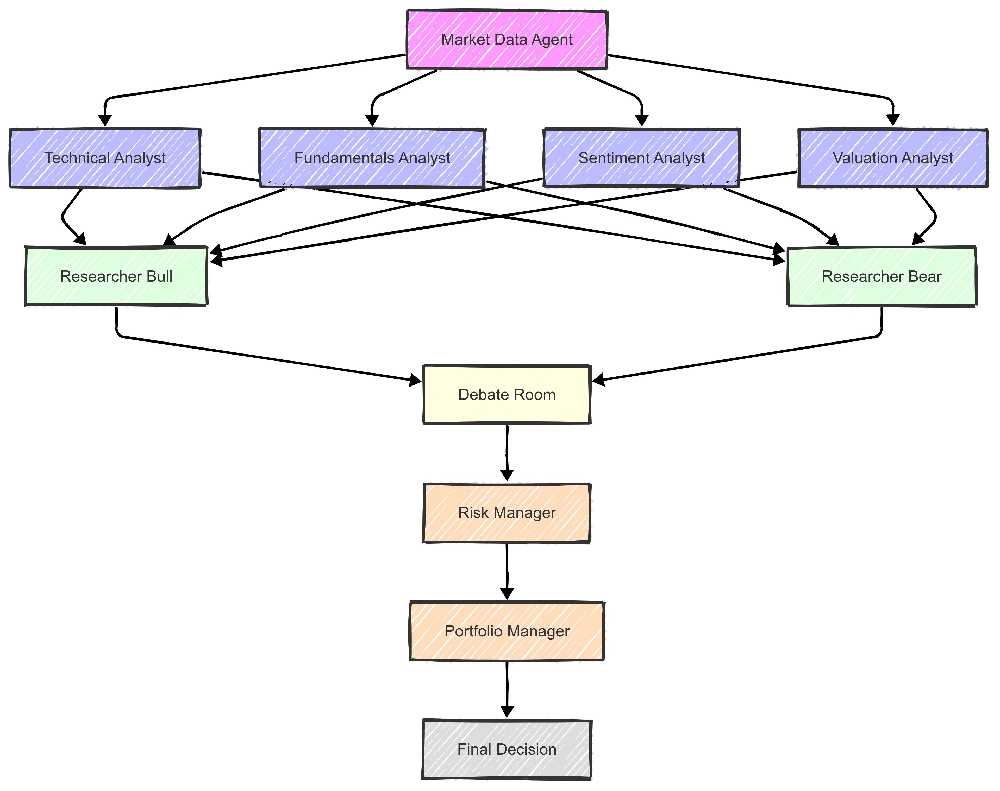
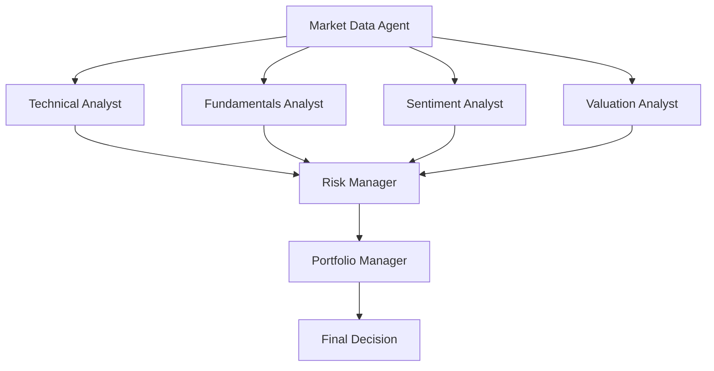

# AI 投资系统

> > 加入我的知识星球（一顿饭钱：99¥）

>（微信号: PareidoliaX，加微信后，我拉你进星球.该微信只做邀请用途，不做任何私人回复。非加星球请勿扰哈。），

>星球中还有更多我个人分享的资料和对该项目的解析噢。
> > 另外，星球会提前更新两个版本的代码哈，抢先体验不容错过哦。

这个系统目前是只支持 A 股的哈。

这是一个基于人工智能的投资系统概念验证项目。项目目标是探索如何使用 AI 来辅助投资决策。本项目仅用于**教育目的**，不适用于实际交易或投资。

## 系统架构

### 最新架构 (V2)



新版本的架构做出了以下改进：

1. 引入了多头研究员(Researcher Bull)和空头研究员(Researcher Bear)，让系统能够从不同角度分析市场
2. 增加了辩论室(Debate Room)环节，通过多空双方的辩论来达成更全面的决策
3. 优化了数据流向，使决策过程更加系统化和完整

另外，优化了终端输出，减少了不必要的详细数据显示，使输出更加清晰易读

⚠️ **注意**: 目前回测系统还在测试中，建议使用以下命令来使用系统：

```bash
# 简单模式 - 只显示关键决策信息
poetry run python src/main.py --ticker 000000 #修改成你想要测试的股票代码

# 显示详细推理过程 - 查看每个智能体的分析过程
poetry run python src/main.py --ticker 000000 --show-reasoning #修改成你想要测试的股票代码
```

### 原始架构 (V1)



系统由以下几个协同工作的 agent 组成：

1. Market Data Analyst - 负责收集和预处理市场数据
2. Valuation Agent - 计算股票内在价值并生成交易信号
3. Sentiment Agent - 分析市场情绪并生成交易信号
4. Fundamentals Agent - 分析基本面数据并生成交易信号
5. Technical Analyst - 分析技术指标并生成交易信号
6. Risk Manager - 计算风险指标并设置仓位限制
7. Portfolio Manager - 制定最终交易决策并生成订单

## 免责声明

本项目仅用于**教育和研究目的**。

- 不适用于实际交易或投资
- 不提供任何保证
- 过往业绩不代表未来表现
- 创建者不承担任何财务损失责任
- 投资决策请咨询专业理财顾问

使用本软件即表示您同意仅将其用于学习目的。

## Setup

Clone the repository:

```bash
git clone https://github.com/24mlight/A_Share_investment_Agent.git
cd A_Share_investment_Agent
```

1. Install Poetry:

# Windows (PowerShell)

```powershell
(Invoke-WebRequest -Uri https://install.python-poetry.org -UseBasicParsing).Content | py -
```

# Unix/macOS

```bash
curl -sSL https://install.python-poetry.org | python3 -
```

2. Install dependencies:

```bash
poetry lock --no-update
```

```bash
poetry install
```

3. Set up your environment variables:

```bash
# Create .env file for your API keys
cp .env.example .env

# Get your Gemini API key from https://aistudio.google.com/
```

你可以通过以下两种方式设置环境变量:

1. **直接修改 .env 文件**
   打开 .env 文件,填入你的 API key:

```
GEMINI_API_KEY=your-gemini-api-key-here
GEMINI_MODEL=gemini-1.5-flash
```

2. **通过命令行设置**

Unix/macOS:

```bash
export GEMINI_API_KEY='your-gemini-api-key-here'
export GEMINI_MODEL='gemini-1.5-flash'
```

Windows PowerShell:

```powershell
$env:GEMINI_API_KEY='your-gemini-api-key-here'
$env:GEMINI_MODEL='gemini-1.5-flash'
```

注意: 推荐使用第一种方式(修改 .env 文件)。

## Usage

### Running Our System

系统支持多种运行方式，可以根据需要组合使用不同的参数：

1. **基本运行**

```bash
poetry run python src/main.py --ticker 301155
```

这将使用默认参数运行系统，包括：

- 默认分析 5 条新闻（num_of_news=5）
- 不显示详细分析过程（show_reasoning=False）
- 使用默认的初始资金（initial_capital=100,000）

2. **显示分析推理过程**

```bash
poetry run python src/main.py --ticker 301155 --show-reasoning
```

这将显示每个智能体（Market Data Agent、Technical Analyst、Fundamentals Agent、Sentiment Agent、Risk Manager、Portfolio Manager）的分析过程和推理结果。

这允许你设置：

- initial_capital: 初始现金金额（可选，默认为 100,000）

4. **自定义新闻分析数量和具体日期的投资建议**

```bash
poetry run python src/main.py --ticker 301157 --show-reasoning --end-date 2024-12-11 --num-of-news 20
```

这将：

- 分析指定日期范围内最近的 20 条新闻进行情绪分析
- start-date 和 end-date 格式为 YYYY-MM-DD

5. **回测功能**

```bash
poetry run python src/backtester.py --ticker 301157 --start-date 2024-12-11 --end-date 2025-01-07 --num-of-news 20
```

回测功能支持以下参数：

- ticker: 股票代码
- start-date: 回测开始日期（YYYY-MM-DD）
- end-date: 回测结束日期（YYYY-MM-DD）
- initial-capital: 初始资金（可选，默认为 100,000）
- num-of-news: 情绪分析使用的新闻数量（可选，默认为 5，最大为 100）

### 参数说明

- `--ticker`: 股票代码（必需）
- `--show-reasoning`: 显示分析推理过程（可选，默认为 false）
- `--initial-capital`: 初始现金金额（可选，默认为 100,000）
- `--num-of-news`: 情绪分析使用的新闻数量（可选，默认为 5，最大为 100）
- `--start-date`: 开始日期，格式 YYYY-MM-DD（可选）
- `--end-date`: 结束日期，格式 YYYY-MM-DD（可选）

### 输出说明

系统会输出以下信息：

1. 基本面分析结果
2. 估值分析结果
3. 技术分析结果
4. 情绪分析结果
5. 风险管理评估
6. 最终交易决策

如果使用了`--show-reasoning`参数，还会显示每个智能体的详细分析过程。

**Example Output:**

```
正在获取 301157 的历史行情数据...
开始日期：2024-12-11
结束日期：2024-12-11
成功获取历史行情数据，共 242 条记录

警告：以下指标存在NaN值：
- momentum_1m: 20条
- momentum_3m: 60条
- momentum_6m: 120条
...（这些警告是正常的，是由于某些技术指标需要更长的历史数据才能计算）

正在获取 301157 的财务指标数据...
获取实时行情...
成功获取实时行情数据

获取新浪财务指标...
成功获取新浪财务指标数据，共 3 条记录
最新数据日期：2024-09-30 00:00:00

获取利润表数据...
成功获取利润表数据

构建指标数据...
成功构建指标数据

Final Result:
{
  "action": "buy",
  "quantity": 12500,
  "confidence": 0.42,
  "agent_signals": [
    {
      "agent": "Technical Analysis",
      "signal": "bullish",
      "confidence": 0.6
    },
    {
      "agent": "Fundamental Analysis",
      "signal": "neutral",
      "confidence": 0.5
    },
    {
      "agent": "Sentiment Analysis",
      "signal": "neutral",
      "confidence": 0.8
    },
    {
      "agent": "Valuation Analysis",
      "signal": "bearish",
      "confidence": 0.99
    },
    {
      "agent": "Risk Management",
      "signal": "buy",
      "confidence": 1.0
    }
  ],
  "reasoning": "Risk Management allows a buy action with a maximum quantity of 12500..."
}
```

### 日志文件说明

系统会在 `logs/` 目录下生成以下类型的日志文件：

1. **回测日志**

   - 文件名格式：`backtest_{股票代码}_{当前日期}_{回测开始日期}_{回测结束日期}.log`
   - 示例：`backtest_301157_20250107_20241201_20241230.log`
   - 包含：每个交易日的分析结果、交易决策和投资组合状态

2. **API 调用日志**
   - 文件名格式：`api_calls_{当前日期}.log`
   - 示例：`api_calls_20250107.log`
   - 包含：所有 API 调用的详细信息和响应

所有日期格式均为 YYYY-MM-DD。如果使用了 `--show-reasoning` 参数，详细的分析过程也会记录在日志文件中。

## Project Structure

```
ai-hedge-fund/
├── src/                         # 源代码目录
│   ├── agents/                  # agent定义和工作流
│   │   ├── fundamentals.py      # Fundamentals Agent
│   │   ├── market_data.py       # Market Data Agent
│   │   ├── portfolio_manager.py # Portfolio Manager
│   │   ├── risk_manager.py      # Risk Manager
│   │   ├── sentiment.py         # Sentiment Agent
│   │   ├── state.py            # Agent状态管理
│   │   ├── technicals.py       # Technical Analyst
│   │   └── valuation.py        # Valuation Agent
│   ├── data/                   # 数据存储目录
│   │   ├── sentiment_cache.json # 情绪分析缓存
│   │   └── stock_news/         # 股票新闻数据
│   ├── tools/                  # 工具和功能模块
│   │   ├── api.py              # API接口和数据获取
│   │   ├── data_analyzer.py    # 数据分析工具
│   │   ├── news_crawler.py     # 新闻爬取工具
│   │   ├── openrouter_config.py # OpenRouter配置
│   │   └── test_*.py           # 测试文件
│   ├── utils/                  # 通用工具函数
│   ├── backtester.py          # 回测系统
│   └── main.py                # 主程序入口
├── logs/                      # 日志文件目录
│   ├── api_calls_*.log        # API调用日志
│   └── backtest_*.log         # 回测结果日志
├── .env                       # 环境变量配置
├── .env.example              # 环境变量示例
├── poetry.lock               # Poetry依赖锁定文件
├── pyproject.toml            # Poetry项目配置
└── README.md                 # 项目文档
```

## 贡献指南

1. Fork 本仓库
2. 创建特性分支
3. 提交更改
4. 推送到分支
5. 创建 Pull Request

## 许可证

本项目基于 MIT 许可证 - 详见 LICENSE 文件。

## ☕️ 请作者喝杯咖啡

如果这个项目对你有帮助，欢迎请我喝杯咖啡 ❤️


### 🌟 加入我们的社区

=======
同时也欢迎关注我们的公众号【空指针指向量化 Agent】，获取更多量化投资和 AI 智能交易相关的干货内容！ 🚀

<div style="display: flex; justify-content: space-between;">
    <div style="text-align: center; margin-right: 20px;">
        <p>关注公众号【空指针指向了量化 Agent】，获取更多量化投资和 AI 智能交易相关的干货内容！
        现在关注即可领取 <b>¥20</b> 知识星球优惠券！🎁</p>
        
    </div>
</div>

<div style="text-align: center;">
        <p>欢迎加入我们的知识星球！这里不仅有更多深度干货，还有：<br/>
        🔥 独家策略、资料分享<br/>
        👥 量化投资交流<br/>
        💡 一对一答疑解惑</p>
        
</div>

## 项目详细说明

### 架构设计

本项目是一个基于多个 agent 的 AI 投资系统，采用模块化设计，每个 agent 都有其专门的职责。系统的架构如下：

```
Market Data Analyst → [Technical/Fundamentals/Sentiment/Valuation Analyst] → Risk Manager → Portfolio Manager → Trading Decision
```

#### Agent 角色和职责

1. **Market Data Analyst**

   - 作为系统的入口点
   - 负责收集和预处理所有必要的市场数据
   - 通过 akshare API 获取 A 股市场数据
   - 数据来源：东方财富、新浪财经等

2. **Technical Analyst**

   - 分析价格趋势、成交量、动量等技术指标
   - 生成基于技术分析的交易信号
   - 关注短期市场走势和交易机会

3. **Fundamentals Analyst**

   - 分析公司财务指标和经营状况
   - 评估公司的长期发展潜力
   - 生成基于基本面的交易信号

4. **Sentiment Analyst**

   - 分析市场新闻和舆论数据
   - 评估市场情绪和投资者行为
   - 生成基于情绪的交易信号

5. **Valuation Analyst**

   - 进行公司估值分析
   - 评估股票的内在价值
   - 生成基于估值的交易信号

6. **Risk Manager**

   - 整合所有 agent 的交易信号
   - 评估潜在风险
   - 设定交易限制和风险控制参数
   - 生成风险管理信号

7. **Portfolio Manager**
   - 作为最终决策者
   - 综合考虑所有信号和风险因素
   - 做出最终的交易决策（买入/卖出/持有）
   - 确保决策符合风险管理要求

### 数据流和处理

#### 数据类型

1. **市场数据（Market Data）**

   ```python
   {
       "market_cap": float,        # 总市值
       "volume": float,            # 成交量
       "average_volume": float,    # 平均成交量
       "fifty_two_week_high": float,  # 52周最高价
       "fifty_two_week_low": float    # 52周最低价
   }
   ```

2. **财务指标数据（Financial Metrics）**

   ```python
   {
       # 市场数据
       "market_cap": float,          # 总市值
       "float_market_cap": float,    # 流通市值

       # 盈利数据
       "revenue": float,             # 营业总收入
       "net_income": float,          # 净利润
       "return_on_equity": float,    # 净资产收益率
       "net_margin": float,          # 销售净利率
       "operating_margin": float,    # 营业利润率

       # 增长指标
       "revenue_growth": float,      # 主营业务收入增长率
       "earnings_growth": float,     # 净利润增长率
       "book_value_growth": float,   # 净资产增长率

       # 财务健康指标
       "current_ratio": float,       # 流动比率
       "debt_to_equity": float,      # 资产负债率
       "free_cash_flow_per_share": float,  # 每股经营性现金流
       "earnings_per_share": float,  # 每股收益

       # 估值比率
       "pe_ratio": float,           # 市盈率（动态）
       "price_to_book": float,      # 市净率
       "price_to_sales": float      # 市销率
   }
   ```

3. **财务报表数据（Financial Statements）**

   ```python
   {
       "net_income": float,          # 净利润
       "operating_revenue": float,    # 营业总收入
       "operating_profit": float,     # 营业利润
       "working_capital": float,      # 营运资金
       "depreciation_and_amortization": float,  # 折旧和摊销
       "capital_expenditure": float,  # 资本支出
       "free_cash_flow": float       # 自由现金流
   }
   ```

4. **交易信号（Trading Signals）**

   ```python
   {
       "action": str,               # "buy", "sell", "hold"
       "quantity": int,             # 交易数量
       "confidence": float,         # 置信度 (0-1)
       "agent_signals": [           # 各个 agent 的信号
           {
               "agent": str,        # agent 名称
               "signal": str,       # "bullish", "bearish", "neutral"
               "confidence": float  # 置信度 (0-1)
           }
       ],
       "reasoning": str            # 决策理由
   }
   ```

#### 数据流转过程

1. **数据采集阶段**

   - Market Data Agent 通过 akshare API 获取实时市场数据：
     - 股票实时行情（`stock_zh_a_spot_em`）
     - 历史行情数据（`stock_zh_a_hist`）
     - 财务指标数据（`stock_financial_analysis_indicator`）
     - 财务报表数据（`stock_financial_report_sina`）
   - 新闻数据通过新浪财经 API 获取
   - 所有数据经过标准化处理和格式化

2. **分析阶段**

   - Technical Analyst：

     - 计算技术指标（动量、趋势、波动率等）
     - 分析价格模式和交易信号
     - 生成技术分析评分和建议

   - Fundamentals Analyst：

     - 分析财务报表数据
     - 评估公司基本面状况
     - 生成基本面分析评分

   - Sentiment Analyst：

     - 分析最新的市场新闻
     - 使用 AI 模型评估新闻情感
     - 生成市场情绪评分

   - Valuation Analyst：
     - 计算估值指标
     - 进行 DCF 估值分析
     - 评估股票的内在价值

3. **风险评估阶段**

   Risk Manager 综合考虑多个维度：

   - 市场风险评估（波动率、Beta 等）
   - 头寸规模限制计算
   - 止损止盈水平设定
   - 投资组合风险控制

4. **决策阶段**

   Portfolio Manager 基于以下因素做出决策：

   - 各 Agent 的信号强度和置信度
   - 当前市场状况和风险水平
   - 投资组合状态和现金水平
   - 交易成本和流动性考虑

5. **数据存储和缓存**

   - 情绪分析结果缓存在 `data/sentiment_cache.json`
   - 新闻数据保存在 `data/stock_news/` 目录
   - 日志文件按类型存储在 `logs/` 目录
   - API 调用记录实时写入日志

6. **监控和反馈**

   - 所有 API 调用都有详细的日志记录
   - 每个 Agent 的分析过程可追踪
   - 系统决策过程透明可查
   - 回测结果提供性能评估

### 代理协作机制

1. **信息共享**

   - 所有代理共享同一个状态对象（AgentState）
   - 通过消息传递机制进行通信
   - 每个代理都可以访问必要的历史数据

2. **决策权重**
   Portfolio Manager 在做决策时考虑不同信号的权重：

   - 估值分析：35%
   - 基本面分析：30%
   - 技术分析：25%
   - 情绪分析：10%

3. **风险控制**
   - 强制性风险限制
   - 最大持仓限制
   - 交易规模限制
   - 止损和止盈设置

### 系统特点

1. **模块化设计**

   - 每个代理都是独立的模块
   - 易于维护和升级
   - 可以单独测试和优化

2. **可扩展性**

   - 可以轻松添加新的分析师
   - 支持添加新的数据源
   - 可以扩展决策策略

3. **风险管理**

   - 多层次的风险控制
   - 实时风险评估
   - 自动止损机制

4. **智能决策**
   - 基于多维度分析
   - 考虑多个市场因素
   - 动态调整策略

### 未来展望

1. **数据源扩展**

   - 添加更多 A 股数据源
   - 接入更多财经数据平台
   - 增加社交媒体情绪数据
   - 扩展到港股、美股市场

2. **功能增强**

   - 添加更多技术指标
   - 实现自动化回测
   - 支持多股票组合管理

3. **性能优化**
   - 提高数据处理效率
   - 优化决策算法
   - 增加并行处理能力

### 情感分析功能

情感分析代理（Sentiment Agent）是系统中的关键组件之一，负责分析市场新闻和舆论对股票的潜在影响。

#### 功能特点

1. **新闻数据采集**

   - 自动抓取最新的股票相关新闻
   - 支持多个新闻源
   - 实时更新新闻数据

2. **情感分析处理**

   - 使用先进的 AI 模型分析新闻情感
   - 情感分数范围：-1（极其消极）到 1（极其积极）
   - 考虑新闻的重要性和时效性

3. **交易信号生成**
   - 基于情感分析结果生成交易信号
   - 包含信号类型（看涨/看跌）
   - 提供置信度评估
   - 附带详细的分析理由

#### 情感分数说明

- **1.0**: 极其积极（重大利好消息、超预期业绩、行业政策支持）
- **0.5 到 0.9**: 积极（业绩增长、新项目落地、获得订单）
- **0.1 到 0.4**: 轻微积极（小额合同签订、日常经营正常）
- **0.0**: 中性（日常公告、人事变动、无重大影响的新闻）
- **-0.1 到 -0.4**: 轻微消极（小额诉讼、非核心业务亏损）
- **-0.5 到 -0.9**: 消极（业绩下滑、重要客户流失、行业政策收紧）
- **-1.0**: 极其消极（重大违规、核心业务严重亏损、被监管处罚）

# 结果展示


## 致谢

本项目修改自 [ai-hedge-fund](https://github.com/virattt/ai-hedge-fund.git)。我们衷心感谢原作者的出色工作和启发。原项目为我们针对 A 股市场的适配和改进提供了坚实的基础。
