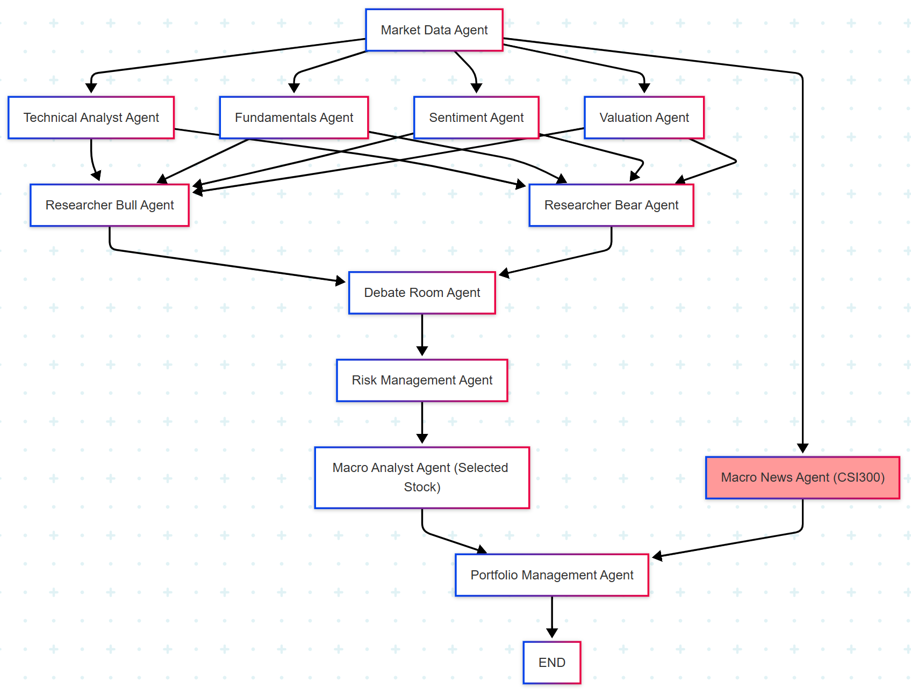
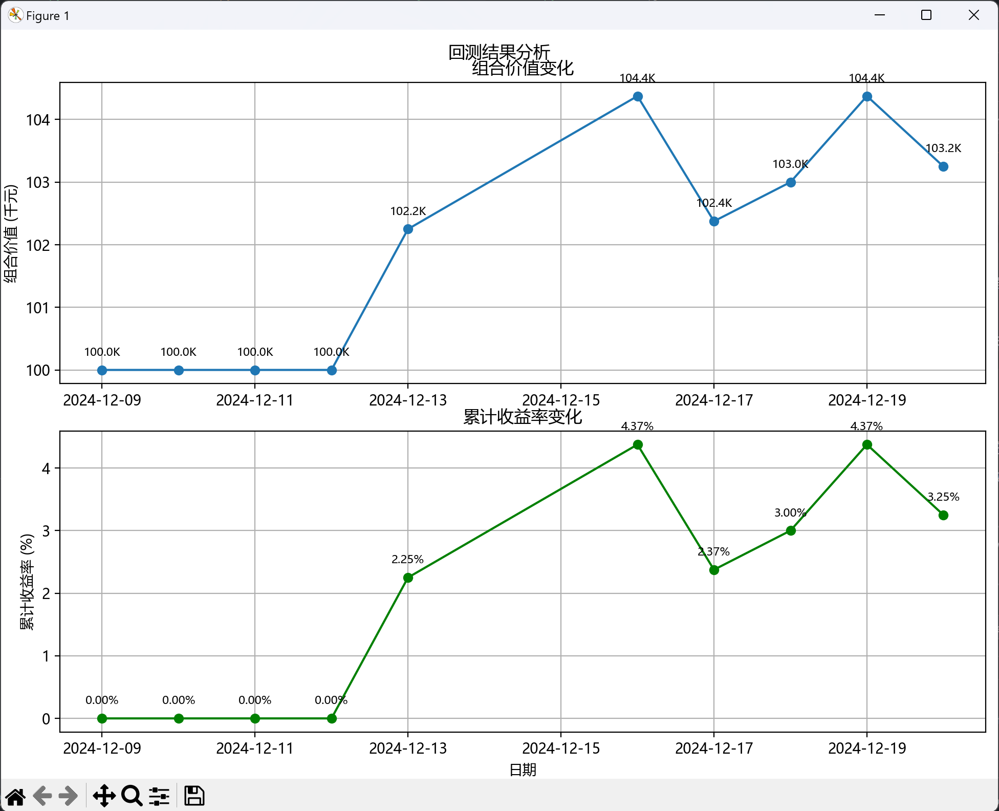

<div align="center">

# 🤖 AI 投资系统 🧠


</div>

**⚠️ 免责声明：本项目仅用于教育和研究目的，不构成任何投资、实际交易建议。投资有风险，决策需谨慎。
再次强调，该系统不涉及任何投资建议，不涉及任何股票推荐，仅用于对于 AI 技术和股市结合感兴趣的朋友。
对 Agent 技术和股市感兴趣者来，
升官发财请往他处。
不再回复任何有关系统给出信息有无用的问题，此系统不构成任何投资建议。**

<div align="center">

</div>

## 项目概述

这是一个基于人工智能的投资系统概念验证项目。项目目标是探索如何使用 AI 来辅助投资决策，通过多 Agent 协同工作，结合大型语言模型 (LLM) 的分析能力，提供多角度的市场解读和投资建议。

### 核心理念：多智能体协同与 LLM 增强决策

系统通过模拟不同角色的研究员（多头、空头）和分析师，进行信息收集、分析、辩论，最终形成投资决策。最新的“辩论室智能增强”机制引入 LLM 作为独立第三方，进一步提升决策的客观性和全面性。

<div align="center">
<table>
  <tr>
    <td align="center"><br><b>多智能体协同</b></td>
    <td align="center"><br><b>LLM 深度分析</b></td>
    <td align="center"><br><b>辩论室机制</b></td>
    <td align="center"><br><b>模块化架构</b></td>
  </tr>
  <tr>
    <td>在多分析师基础上，引入多空研究员，从不同视角分析市场</td>
    <td>引入大型语言模型进行客观评估和洞察生成</td>
    <td>通过多方辩论达成更全面的决策</td>
    <td>各 Agent 独立运作，易于扩展和维护</td>
  </tr>
</table>
</div>

<div align="center">

</div>

## 系统架构



新版本的架构做出了以下改进：

1.  引入了多头研究员(Researcher Bull)和空头研究员(Researcher Bear)，让系统能够从不同角度分析市场
2.  增加了辩论室(Debate Room)环节，通过多空双方的辩论来达成更全面的决策
3.  优化了数据流向，使决策过程更加系统化和完整

另外，优化了终端输出，减少了不必要的详细数据显示，使输出更加清晰易读。

## 最新功能：

### 2025.06.22 新闻搜索功能升级

我们对新闻获取系统进行了重大升级，显著提升了新闻数据的质量和获取效率：

1.  **智能搜索引擎**：集成了先进的搜索功能，能够更精准地获取相关财经新闻
2.  **多源新闻整合**：支持从多个主流财经网站获取新闻，包括新浪财经、网易财经、东方财富等
3.  **智能缓存系统**：
    - **增量缓存**：当请求更多新闻时，系统会智能地利用已有缓存，只获取差额部分
    - **去重机制**：基于新闻标题自动去重，避免重复内容
    - **时效性管理**：自动检查缓存有效性，确保数据时效性
    - **缓存统计**：详细记录缓存使用情况，包括原缓存数量、新获取数量等
4.  **优化的查询策略**：
    - 针对 A 股市场特点优化搜索关键词
    - 支持时间范围限制，可获取特定日期前的新闻
    - 智能过滤无关内容，提高新闻质量

### 2025.04.27 宏观分析师

### 2025.03.27 辩论室智能增强

我们最新升级了辩论室(Debate Room)模块的决策机制：

1.  **LLM 第三方分析**：引入大型语言模型作为独立的第三方分析师，对多空观点进行客观评估
2.  **混合置信度计算**：将传统的多空置信度差异与 LLM 评分进行加权融合，形成更全面的决策依据
3.  **增强的辩论机制**：系统现在能够自动汇总所有研究员的观点，生成结构化分析，并整合进最终决策

这一改进使决策过程更加平衡客观，特别适合在市场信息复杂、多方观点存在分歧的情况下提供更可靠的投资建议。未来我们将持续优化这一机制，进一步提升决策质量。

<div align="center">

</div>

## 🛠️ 安装与设置 (Setup)

首先，克隆本仓库到您的本地：

```bash
git clone [https://github.com/24mlight/A_Share_investment_Agent.git](https://github.com/24mlight/A_Share_investment_Agent.git)
cd A_Share_investment_Agent
```

### 1. 安装 Poetry

Poetry 是一个用于 Python 依赖管理和打包的工具。

**Windows (PowerShell):**

```powershell
(Invoke-WebRequest -Uri [https://install.python-poetry.org](https://install.python-poetry.org) -UseBasicParsing).Content | py -
```

**Unix/macOS:**

```bash
curl -sSL [https://install.python-poetry.org](https://install.python-poetry.org) | python3 -
```

### 2. 安装项目依赖

使用 Poetry 安装项目所需的依赖包：

```bash
poetry lock --no-update
```

```bash
poetry install
```

### 3. 配置环境变量

环境变量用于存储 API 密钥等敏感信息。

首先，复制示例环境变量文件：

```bash
# Create .env file for your API keys
cp .env.example .env
```

然后，您可以获取您的 Gemini API 密钥：[Google AI Studio](https://aistudio.google.com/)

您可以通过以下两种方式设置环境变量:

**a. 直接修改 `.env` 文件 (推荐)**
打开项目根目录下的 `.env` 文件, 填入您的 API key:

```env
# Gemini API 配置
GEMINI_API_KEY=your-gemini-api-key
GEMINI_MODEL=gemini-1.5-flash

# OpenAI Compatible API 配置（可选）
OPENAI_COMPATIBLE_API_KEY=your-openai-compatible-api-key
OPENAI_COMPATIBLE_BASE_URL=https://your-api-endpoint.com/v1
OPENAI_COMPATIBLE_MODEL=your-model-name
```

**注意:** 系统会优先使用 OpenAI Compatible API（如果配置了），否则会使用 Gemini API。

**b. 通过命令行设置**

**Unix/macOS:**

```bash
# Gemini API 配置
export GEMINI_API_KEY='your-gemini-api-key'
export GEMINI_MODEL='gemini-1.5-flash'

# OpenAI Compatible API 配置（可选）
export OPENAI_COMPATIBLE_API_KEY='your-openai-compatible-api-key'
export OPENAI_COMPATIBLE_BASE_URL='https://your-api-endpoint.com/v1'
export OPENAI_COMPATIBLE_MODEL='your-model-name'
```

**Windows PowerShell:**

```powershell
# Gemini API 配置
$env:GEMINI_API_KEY='your-gemini-api-key'
$env:GEMINI_MODEL='gemini-1.5-flash'

# OpenAI Compatible API 配置（可选）
$env:OPENAI_COMPATIBLE_API_KEY='your-openai-compatible-api-key'
$env:OPENAI_COMPATIBLE_BASE_URL='https://your-api-endpoint.com/v1'
$env:OPENAI_COMPATIBLE_MODEL='your-model-name'
```

<div align="center">

</div>

## 🚀 使用指南 (Usage)

⚠️ **注意**: 目前回测系统还在测试中。

系统支持多种运行方式：

### 1. 命令行分析模式

这是直接与系统交互进行股票分析的主要方式。

**基本运行 (只显示关键决策信息):**

```bash
poetry run python src/main.py --ticker 000000 #修改成你想要测试的股票代码
```

例如，分析股票代码为 `301155` 的情况：

```bash
poetry run python src/main.py --ticker 301155
```

**显示详细推理过程 (查看每个智能体的分析过程):**

```bash
poetry run python src/main.py --ticker 000000 --show-reasoning #修改成你想要测试的股票代码
```

例如:

```bash
poetry run python src/main.py --ticker 301155 --show-reasoning
```

**回测功能**

```bash
poetry run python src/backtester.py --ticker 301157 --start-date 2024-12-11 --end-date 2025-01-07 --num-of-news 20
```

回测功能支持以下参数：

- `ticker`: 股票代码
- `start-date`: 回测开始日期（`YYYY-MM-DD`）
- `end-date`: 回测结束日期（`YYYY-MM-DD`）
- `initial-capital`: 初始资金（可选，默认为 `100,000`）
- `num-of-news`: 情绪分析使用的新闻数量（可选，默认为 `5`，最大为 `100`）

#### 参数说明

- `--ticker`: 股票代码（必需）
- `--show-reasoning`: 显示分析推理过程（可选，默认为 `false`）
- `--initial-capital`: 初始现金金额（可选，默认为 `100,000`）
- `--num-of-news`: 情绪分析使用的新闻数量（可选，默认为 `5`，最大为 `100`）
- `--start-date`: 开始日期，格式 `YYYY-MM-DD`（可选）
- `--end-date`: 结束日期，格式 `YYYY-MM-DD`（可选）

### 2. 后端 API 服务模式

此模式会启动一个 FastAPI 后端服务，允许通过 API 与系统交互，适合希望基于此后端开发自定义前端界面的用户。

```bash
# 启动API服务
poetry run python run_with_backend.py
```

启动后，可以通过浏览器访问 `http://localhost:8000/docs` 使用交互式 API 界面 (Swagger UI)。

**常用 API 端点包括：**

- **开始新的分析**: `POST /analysis/start` (请求体中提供股票代码、初始资金等)
- **查看当前工作流状态**: `GET /api/workflow/status` (获取当前运行 ID 和活跃 Agent 状态)
- **列出历史运行**: `GET /runs/` (获取已完成运行列表)
- **查看特定运行的流程图**: `GET /runs/{run_id}/flow`
- **查看特定 Agent 的详细执行日志**: `GET /runs/{run_id}/agents/{agent_name}`
- **查看 LLM 交互日志**: `GET /logs/` (具体路径可能需根据实现确认)

**API 服务模式的优势：**

- 分析任务在后台异步执行。
- 所有结果均可通过 API 查询。
- 无需为每次分析重启程序。
- 可作为开发自定义前端的基础。

详细的后端 API 文档请参阅：[查看详细的后端 API 文档](./backend/README.md)

### 参数说明 (命令行模式)

- `--ticker`: 股票代码 (必需)
- `--show-reasoning`: 显示分析推理过程 (可选, 默认为 `false`)
- `--initial-capital`: 初始现金金额 (可选, 默认为 `100,000`)
- `--num-of-news`: 情绪分析使用的新闻数量 (可选, 默认为 `5`)

### 命令行模式输出说明

系统会输出以下信息：

1.  基本面分析结果
2.  估值分析结果
3.  技术分析结果
4.  情绪分析结果
5.  风险管理评估
6.  最终交易决策

如果使用了`--show-reasoning`参数，还会显示每个智能体的详细分析过程。

**示例输出 (Example Output):**

```
正在获取 301157 的历史行情数据...
开始日期：2024-12-11
结束日期：2024-12-11
成功获取历史行情数据，共 242 条记录

警告：以下指标存在NaN值：
- momentum_1m: 20条
- momentum_3m: 60条
- momentum_6m: 120条
...（这些警告是正常的，是由于某些技术指标需要更长的历史数据才能计算）

正在获取 301157 的财务指标数据...
获取实时行情...
成功获取实时行情数据

获取新浪财务指标...
成功获取新浪财务指标数据，共 3 条记录
最新数据日期：2024-09-30 00:00:00

获取利润表数据...
成功获取利润表数据

构建指标数据...
成功构建指标数据

Final Result:
{
  "action": "buy",
  "quantity": 12500,
  "confidence": 0.42,
  "agent_signals": [
    {
      "agent": "Technical Analysis",
      "signal": "bullish",
      "confidence": 0.6
    },
    {
      "agent": "Fundamental Analysis",
      "signal": "neutral",
      "confidence": 0.5
    },
    {
      "agent": "Sentiment Analysis",
      "signal": "neutral",
      "confidence": 0.8
    },
    {
      "agent": "Valuation Analysis",
      "signal": "bearish",
      "confidence": 0.99
    },
    {
      "agent": "Risk Management",
      "signal": "buy",
      "confidence": 1.0
    }
  ],
  "reasoning": "Risk Management allows a buy action with a maximum quantity of 12500..."
}
```

### 日志文件说明

系统会在 `logs/` 目录下生成以下类型的日志文件：

1.  **回测日志**

    - 文件名格式：`backtest_{股票代码}_{当前日期}_{回测开始日期}_{回测结束日期}.log`
    - 示例：`backtest_301157_20250107_20241201_20241230.log`
    - 包含：每个交易日的分析结果、交易决策和投资组合状态

2.  **API 调用日志**
    - 文件名格式：`api_calls_{当前日期}.log`
    - 示例：`api_calls_20250107.log`
    - 包含：所有 API 调用的详细信息和响应

所有日期格式均为 YYYY-MM-DD。如果使用了 `--show-reasoning` 参数，详细的分析过程也会记录在日志文件中。

<div align="center">

</div>

## 📂 项目结构 (Project Structure)

```
A_Share_investment_Agent/
├── backend/                     # 后端 API 和服务
│   ├── dependencies.py          # 依赖注入 (如 LogStorage)
│   ├── main.py                  # FastAPI 应用实例
│   ├── models/                  # API 请求/响应模型 (Pydantic)
│   │   ├── analysis.py          # /analysis/ 相关路由
│   │   ├── api_runs.py          # /api/runs/ 相关路由 (基于 api_state)
│   │   ├── logs.py              # /logs/ 相关路由
│   │   ├── runs.py              # /runs/ 相关路由 (基于 BaseLogStorage)
│   │   └── workflow.py          # /api/workflow/ 相关路由
│   ├── schemas.py               # 内部数据结构/日志模型 (Pydantic)
│   ├── services/                # 业务逻辑服务
│   │   └── analysis.py          # 股票分析服务
│   ├── state.py                 # 内存状态管理 (api_state)
│   ├── storage/                 # 日志存储实现
│   │   ├── base.py              # BaseLogStorage 接口定义
│   │   └── memory.py            # InMemoryLogStorage 实现
│   └── utils/                   # 后端工具函数
│       ├── api_utils.py         # API 相关工具
│       └── context_managers.py  # 上下文管理器 (如 workflow_run)
├── src/                         # Agent 核心逻辑和工具
│   ├── agents/                  # Agent 定义和工作流
│   │   ├── __init__.py
│   │   ├── debate_room.py
│   │   ├── fundamentals.py
│   │   ├── macro_analyst.py       # 宏观分析师Agent
│   │   ├── market_data.py
│   │   ├── portfolio_manager.py
│   │   ├── researcher_bear.py
│   │   ├── researcher_bull.py
│   │   ├── risk_manager.py
│   │   ├── sentiment.py
│   │   ├── state.py
│   │   ├── technicals.py
│   │   └── valuation.py
│   ├── data/                   # 数据存储目录 (本地缓存等)
│   │   ├── img/                # 项目图片
│   │   ├── sentiment_cache.json  # 情感分析结果缓存
│   │   ├── macro_analysis_cache.json  # 宏观分析结果缓存
│   │   └── stock_news/         # 股票新闻数据
│   ├── tools/                  # 工具和功能模块 (LLM, 数据获取)
│   │   ├── __init__.py
│   │   ├── api.py
│   │   ├── data_analyzer.py
│   │   ├── news_crawler.py
│   │   └── openrouter_config.py
│   ├── utils/                  # 通用工具函数 (日志, LLM客户端, 序列化)
│   │   ├── __init__.py
│   │   ├── api_utils.py        # Agent 共享的API工具 (逐步迁移至 backend)
│   │   ├── llm_clients.py
│   │   ├── llm_interaction_logger.py
│   │   ├── logging_config.py
│   │   ├── output_logger.py
│   │   ├── serialization.py
│   │   ├── structured_terminal.py  # 结构化终端输出
│   │   └── summary_report.py    # 汇总报告生成
│   ├── backtester.py          # 回测系统 (可能需要检查状态)
│   └── main.py                # Agent 工作流定义和命令行入口
├── logs/                      # 日志文件目录 (主要由 OutputLogger 生成)
├── .env                       # 环境变量配置
├── .env.example              # 环境变量示例
├── poetry.lock               # Poetry依赖锁定文件
├── pyproject.toml            # Poetry项目配置
├── run_with_backend.py       # 启动后端并可选执行分析的脚本
└── README.md                 # 项目文档
```

<div align="center">

</div>

## 🤝 贡献指南 (Contributing)

我们欢迎各种形式的贡献！

1.  Fork 本仓库
2.  创建您的特性分支 (`git checkout -b feature/AmazingFeature`)
3.  提交您的更改 (`git commit -m 'Add some AmazingFeature'`)
4.  推送到分支 (`git push origin feature/AmazingFeature`)
5.  创建 Pull Request

<div align="center">

</div>

## ☕️ 支持

如果这个项目对你有帮助，欢迎请我喝杯咖啡 ❤️

<div align="center">
  
</div>


## 📖 项目详细说明

### 架构设计

本项目是一个基于多个 agent 的 AI 投资系统，采用模块化设计，每个 agent 都有其专门的职责。系统的架构如下：

```
Market Data Analyst → [Technical/Fundamentals/Sentiment/Valuation Analyst & Researcher Bull/Bear & Debate Room] → Risk Manager → Portfolio Manager → Trading Decision
```

_(架构图已在前面展示)_

#### Agent 角色和职责

1.  **Market Data Analyst**

    - 作为系统的入口点
    - 负责收集和预处理所有必要的市场数据
    - 通过 akshare API 获取 A 股市场数据
    - 数据来源：东方财富、新浪财经等

2.  **Technical Analyst**

    - 分析价格趋势、成交量、动量等技术指标
    - 生成基于技术分析的交易信号
    - 关注短期市场走势和交易机会

3.  **Fundamentals Analyst**

    - 分析公司财务指标和经营状况
    - 评估公司的长期发展潜力
    - 生成基于基本面的交易信号

4.  **Sentiment Analyst**

    - 分析市场新闻和舆论数据
    - 评估市场情绪和投资者行为
    - 生成基于情绪的交易信号

5.  **Valuation Analyst**

    - 进行公司估值分析
    - 评估股票的内在价值
    - 生成基于估值的交易信号

6.  **Researcher Bull / Researcher Bear** (新增)

    - 分别从多头和空头角度进行深入研究和分析，提供对立观点。

7.  **Debate Room** (新增与增强)

    - 多空研究员在此陈述观点并进行辩论。
    - 引入 LLM 作为第三方分析师，对辩论内容和观点进行客观评估。
    - 综合各方观点和 LLM 评分，形成更全面的决策依据。

8.  **Risk Manager**

    - 整合所有 agent 的交易信号和辩论结果
    - 评估潜在风险
    - 设定交易限制和风险控制参数
    - 生成风险管理信号

9.  **Portfolio Manager**
    - 作为最终决策者
    - 综合考虑所有信号、辩论结果和风险因素
    - 做出最终的交易决策（买入/卖出/持有）
    - 确保决策符合风险管理要求

### 数据流和处理

#### 数据类型

1.  **市场数据 (Market Data)**

    ```python
    {
       "market_cap": float,        # 总市值
       "volume": float,            # 成交量
       "average_volume": float,    # 平均成交量
       "fifty_two_week_high": float,  # 52周最高价
       "fifty_two_week_low": float    # 52周最低价
    }
    ```

2.  **财务指标数据 (Financial Metrics)**

    ```python
    {
       # 市场数据
       "market_cap": float,          # 总市值
       "float_market_cap": float,    # 流通市值

       # 盈利数据
       "revenue": float,             # 营业总收入
       "net_income": float,          # 净利润
       "return_on_equity": float,    # 净资产收益率
       "net_margin": float,          # 销售净利率
       "operating_margin": float,    # 营业利润率

       # 增长指标
       "revenue_growth": float,      # 主营业务收入增长率
       "earnings_growth": float,     # 净利润增长率
       "book_value_growth": float,   # 净资产增长率

       # 财务健康指标
       "current_ratio": float,       # 流动比率
       "debt_to_equity": float,      # 资产负债率
       "free_cash_flow_per_share": float,  # 每股经营性现金流
       "earnings_per_share": float,  # 每股收益

       # 估值比率
       "pe_ratio": float,           # 市盈率（动态）
       "price_to_book": float,      # 市净率
       "price_to_sales": float      # 市销率
    }
    ```

3.  **财务报表数据 (Financial Statements)**

    ```python
    {
       "net_income": float,          # 净利润
       "operating_revenue": float,    # 营业总收入
       "operating_profit": float,     # 营业利润
       "working_capital": float,      # 营运资金
       "depreciation_and_amortization": float,  # 折旧和摊销
       "capital_expenditure": float,  # 资本支出
       "free_cash_flow": float       # 自由现金流
    }
    ```

4.  **交易信号 (Trading Signals)**
    ```python
    {
       "action": str,               # "buy", "sell", "hold"
       "quantity": int,             # 交易数量
       "confidence": float,         # 置信度 (0-1) (可能是混合置信度)
       "agent_signals": [           # 各个 agent 的信号
           {
               "agent": str,        # agent 名称
               "signal": str,       # "bullish", "bearish", "neutral"
               "confidence": float  # 置信度 (0-1)
           }
       ],
       "reasoning": str            # 决策理由 (可能包含辩论摘要和LLM评估)
    }
    ```

#### 数据流转过程

1.  **数据采集阶段**

    - Market Data Agent 通过 akshare API 获取实时市场数据：
      - 股票实时行情 (`stock_zh_a_spot_em`)
      - 历史行情数据 (`stock_zh_a_hist`)
      - 财务指标数据 (`stock_financial_analysis_indicator`)
      - 财务报表数据 (`stock_financial_report_sina`)
    - 新闻数据通过新浪财经 API 获取
    - 所有数据经过标准化处理和格式化

2.  **分析阶段**

    - Technical Analyst：计算技术指标，分析价格模式，生成技术分析评分和建议。
    - Fundamentals Analyst：分析财务报表，评估基本面，生成基本面分析评分。
    - Sentiment Analyst：分析市场新闻，使用 AI 模型评估情感，生成市场情绪评分。
    - Valuation Analyst：计算估值指标，进行 DCF 估值，评估内在价值。
    - Researcher Bull/Bear：从各自立场出发，进行深入分析，准备辩论材料。

3.  **辩论与评估阶段 (Debate Room)**

    - 多空研究员提交观点。
    - 系统汇总观点，可能由 LLM 辅助生成结构化分析。
    - LLM 作为第三方对观点进行客观评估，给出评分。
    - 计算混合置信度。

4.  **风险评估阶段**
    Risk Manager 综合考虑多个维度：

    - 市场风险评估（波动率、Beta 等）
    - 头寸规模限制计算
    - 止损止盈水平设定
    - 投资组合风险控制
    - 整合来自辩论室的增强信号。

5.  **决策阶段**
    Portfolio Manager 基于以下因素做出决策：

    - 各 Agent 的信号强度和置信度。
    - 辩论室的综合结论和混合置信度。
    - 当前市场状况和风险水平。
    - 投资组合状态和现金水平。
    - 交易成本和流动性考虑。

6.  **数据存储和缓存**

    - 情绪分析结果缓存在 `data/sentiment_cache.json`
    - 新闻数据保存在 `data/stock_news/` 目录
    - 日志文件按类型存储在 `logs/` 目录
    - API 调用记录实时写入日志

7.  **监控和反馈**
    - 所有 API 调用都有详细的日志记录
    - 每个 Agent 的分析过程可追踪
    - 系统决策过程（包括辩论环节）透明可查
    - 回测结果提供性能评估

### 代理协作机制

1.  **信息共享**

    - 所有代理共享同一个状态对象 (AgentState) 或通过明确定义的数据结构传递信息。
    - 通过消息传递机制或顺序调用进行通信。
    - 每个代理都可以访问必要的历史数据和前序分析结果。

2.  **决策权重与融合**
    Portfolio Manager 在做决策时考虑不同信号的权重，并结合辩论室的混合置信度：

    - 估值分析：(示例权重) 35%
    - 基本面分析：(示例权重) 30%
    - 技术分析：(示例权重) 25%
    - 情绪分析：(示例权重) 10%
    - 辩论室结论：可能作为最终决策的重要调整因子或独立置信度来源。

3.  **风险控制**
    - 强制性风险限制
    - 最大持仓限制
    - 交易规模限制
    - 止损和止盈设置

### 系统特点

1.  **多 LLM 支持**

    - 支持 Google Gemini API
    - 支持任何兼容 OpenAI API 格式的 LLM 服务（如华为云方舟、OpenRouter 等）
    - 智能切换功能：自动选择可用的 LLM 服务

2.  **模块化设计**

    - 每个代理都是独立的模块
    - 易于维护和升级
    - 可以单独测试和优化

3.  **可扩展性**

    - 可以轻松添加新的分析师或研究员角色
    - 支持添加新的数据源
    - 可以扩展决策策略和辩论机制

4.  **风险管理**

    - 多层次的风险控制
    - 实时风险评估
    - 自动止损机制 (规划中或部分实现)

5.  **智能决策与解释性**
    - 基于多维度分析和多方观点博弈
    - 考虑多个市场因素
    - 动态调整策略
    - 通过 `--show-reasoning` 和辩论室机制增强决策过程的透明度和可解释性

### 未来展望

1.  **数据源扩展**

    - 添加更多 A 股数据源 (如财报、公告的结构化数据)
    - 接入更多财经数据平台
    - 增加社交媒体情绪数据、行业研报等另类数据
    - 扩展到港股、美股市场

2.  **功能增强**

    - 添加更多复杂技术指标和量化策略因子
    - 实现更完善和自动化的回测系统，支持参数优化
    - 支持多股票组合管理和动态调仓
    - 增强 LLM 在策略生成、代码解释、市场总结等方面的应用

3.  **性能优化**
    - 提高数据处理效率，优化 Agent 间通信
    - 优化决策算法和 LLM 调用效率
    - 增加并行处理能力，支持更大规模的分析任务

### 情感分析功能 (Sentiment Agent)

情感分析代理（Sentiment Agent）是系统中的关键组件之一，负责分析市场新闻和舆论对股票的潜在影响。

#### 功能特点

1.  **新闻数据采集**

    - 自动抓取最新的股票相关新闻
    - 支持多个新闻源 (当前主要为新浪财经)
    - 实时更新新闻数据 (根据调用频率)

2.  **情感分析处理**

    - 使用先进的 AI 模型 (LLM) 分析新闻情感
    - 情感分数范围：-1（极其消极）到 1（极其积极）
    - 考虑新闻的重要性和时效性 (隐式或显式)

3.  **交易信号生成**
    - 基于情感分析结果生成交易信号
    - 包含信号类型（看涨/看跌/中性）
    - 提供置信度评估
    - 附带详细的分析理由 (可能由 LLM 生成摘要)

#### 情感分数说明

- **1.0**: 极其积极（重大利好消息、超预期业绩、行业政策支持）
- **0.5 到 0.9**: 积极（业绩增长、新项目落地、获得订单）
- **0.1 到 0.4**: 轻微积极（小额合同签订、日常经营正常）
- **0.0**: 中性（日常公告、人事变动、无重大影响的新闻）
- **-0.1 到 -0.4**: 轻微消极（小额诉讼、非核心业务亏损）
- **-0.5 到 -0.9**: 消极（业绩下滑、重要客户流失、行业政策收紧）
- **-1.0**: 极其消极（重大违规、核心业务严重亏损、被监管处罚）

<div align="center">

</div>

## 📊 结果展示 (Example Image)



<div align="center">

</div>

## 🙏 致谢 (Acknowledgements)

本项目修改自 [ai-hedge-fund](https://github.com/virattt/ai-hedge-fund.git)。我们衷心感谢原作者的出色工作和启发。原项目为我们针对 A 股市场的适配和改进提供了坚实的基础。

<div align="center">

</div>

## 📜 许可证 (License)

本项目使用双重许可证：

This project is dual-licensed:

### 原始代码 - MIT 许可证 / Original Code - MIT License

- 原始代码（来自 [ai-hedge-fund](https://github.com/virattt/ai-hedge-fund)）采用 MIT 许可证。
- 允许商业和非商业使用、修改和分发。

### 修改和新增代码 - GNU GPL v3 with Non-Commercial Clause

- 由 `24mlight` 创建的所有修改和新增代码采用 GNU General Public License v3 (GPL v3)，并附加非商业条款。
- 允许非商业使用、修改和分发，需提供源代码。
- **严格禁止任何商业用途**（如商业产品、服务、销售或获取商业利益）。
- 必须保留原始版权声明和许可证声明。
- 衍生作品必须以相同许可证（GPL v3 with Non-Commercial Clause）分发。

详细信息请参阅 `LICENSE` 文件。

<div align="center">

</div>
